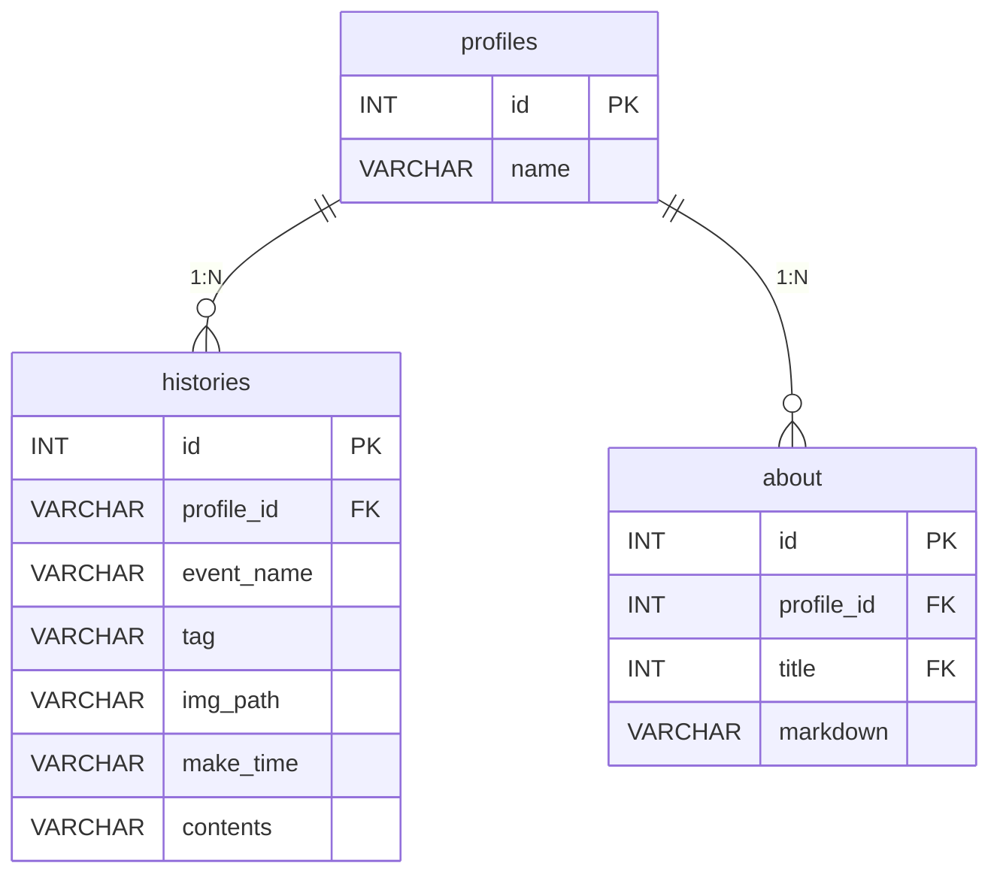

## データベース構成図
データベース構成を以下の図に示す。

```mermaid
erDiagram
    profiles ||--o{ histories:"1:N"
    profiles ||--o{ about:"1:N"

    profiles {
        INT id PK
        VARCHAR name 
    }

    histories {
        INT id PK
        VARCHAR profile_id FK
        VARCHAR event_name
        VARCHAR tag
        VARCHAR img_path
        VARCHAR make_time
        VARCHAR contents
    }

    about {
        INT id PK
        INT profile_id FK
        INT title FK
        VARCHAR markdown
    }
```
